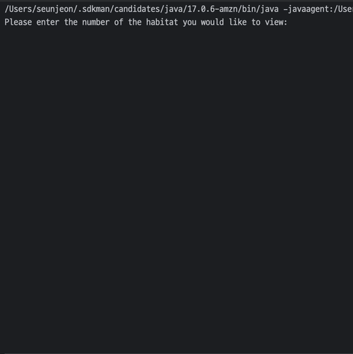

# Zookeeper (Java)

hyperskill java project - zookeeper (Java)

## 개요

동물원 내 동물의 상태 확인을 위한 애플리케이션

- 프로그램은 동물의 고정된 데이터를 저장 중
- 사용자는 인덱스 번호를 입력하여 원하는 동물의 상태를 확인할 수 있음

## 개발 환경

- Java 17
- IntelliJ IDEA 2023.2.3 (Ultimate Edition)

## 배운 것

- `Scanner` 클래스를 사용한 기본 입력 처리
  - 문자열 토큰의 개념
  - `next()`, `nextLine()`, `nextInt()` 등의 사용과 차이점
- `System.out.printf()`, `String.format()`, `formatted()`를 사용한 문자열 포맷 처리
- 텍스트 블록을 사용한 다중 라인 문자열 처리